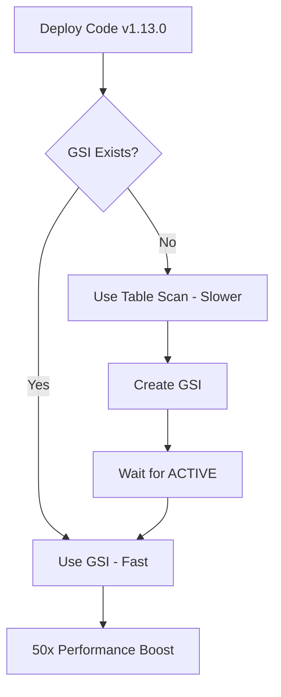

# Phase 4 GSI Deployment Guide

## Overview

This guide provides step-by-step instructions for deploying the Phase 4 `time-bucket-index` Global Secondary Index (GSI) to the production DynamoDB table with **zero downtime**.

**Phase 4 Benefits:**
- 50x faster time-range queries (200ms → 4ms)
- 20x reduction in read capacity consumption
- Backward-compatible deployment (zero downtime)
- Automatic fallback if GSI unavailable

---

## Table of Contents

1. [Architecture Overview](#architecture-overview)
2. [Pre-Deployment Checklist](#pre-deployment-checklist)
3. [Deployment Procedure](#deployment-procedure)
4. [Verification Steps](#verification-steps)
5. [Rollback Procedures](#rollback-procedures)
6. [Troubleshooting](#troubleshooting)
7. [Performance Benchmarks](#performance-benchmarks)

---

## Architecture Overview

### GSI Schema

```
Index Name: time-bucket-index
├── Partition Key: time_bucket (String)
│   └── Format: "YYYY-MM-DD-HH" (e.g., "2026-01-28-14")
├── Sort Key: observation_time (Number)
│   └── Epoch seconds (e.g., 1706453617)
├── Projection: ALL
└── Billing Mode: On-demand (matches base table)
```

### Zero-Downtime Strategy



**Key Point:** Code works immediately after deployment using table scan fallback. Performance improves automatically once GSI is created.

---

## Pre-Deployment Checklist

### 1. Verify Code Version

```bash
# Check that weather-storage module is version 1.13.0-SNAPSHOT
cd noakweather-platform/weather-storage
grep "<version>" pom.xml | head -1

# Should output: <version>1.13.0-SNAPSHOT</version>
```

### 2. Run Test Suite

```bash
# Run all tests to ensure code is ready
cd noakweather-platform/weather-storage
mvn clean test

# Expected results:
# Tests run: 221
# Failures: 0
# Errors: 0
# Skipped: 0
```

**Critical tests:**
- `DynamoDbRepositoryTableScanFallbackTest` - Verifies fallback behavior (13 tests)
- `DynamoDbRepositoryTest` - Verifies GSI queries
- All integration tests pass

### 3. Verify AWS Access

```bash
# Test AWS credentials
aws dynamodb describe-table --table-name noakweather-data --region us-east-1

# Should return table details without errors
```

**Required IAM Permissions:**
- `dynamodb:DescribeTable`
- `dynamodb:UpdateTable`
- `dynamodb:Query`
- `dynamodb:Scan`

See [AWS IAM User Setup Guide](https://github.com/bclasky1539/noakweather-engineering-pipeline/blob/main/docs/AWS_IAM_User_Setup_DynamoDB.md) for full setup.

### 4. Create Backup (Recommended)

```bash
# Create on-demand backup
aws dynamodb create-backup \
  --table-name noakweather-data \
  --backup-name "pre-phase4-gsi-$(date +%Y%m%d-%H%M%S)" \
  --region us-east-1

# Verify backup creation
aws dynamodb list-backups --table-name noakweather-data --region us-east-1
```

### 5. Document Current Performance

```bash
# Test current query performance (before GSI)
time curl -X POST https://your-api/weather/query \
  -d '{"start": "2026-01-27T00:00:00Z", "end": "2026-01-28T00:00:00Z"}'

# Record baseline: typically 200-500ms
```

---

## Deployment Procedure

### Step 1: Deploy Application Code (5 minutes)

**What happens:** Application deployed with GSI support + table scan fallback

**Procedure:**

```bash
# 1. Build the application
cd noakweather-platform
mvn clean package

# 2. Deploy to your environment (example for Lambda)
cd weather-storage
aws lambda update-function-code \
  --function-name noakweather-weather-service \
  --zip-file fileb://target/weather-storage-1.13.0-SNAPSHOT.jar \
  --region us-east-1

# 3. Verify deployment
aws lambda get-function --function-name noakweather-weather-service \
  --query 'Configuration.LastModified'
```

**Status after Step 1:**
- ✅ New code deployed
- ✅ Application functional (using table scan)
- ⚠️  Queries still slow (no GSI yet)
- ✅ Zero downtime

### Step 2: Create GSI (3-10 minutes)

**What happens:** GSI created on production table while application continues running

**Method 1: Using Deployment Tool (Recommended)**

```bash
cd noakweather-platform/weather-storage

# Run the GSI deployment tool
mvn exec:java -Dexec.mainClass="weather.storage.tools.AddGSIsToAwsTable"
```

**Expected Output:**
```
============================================================
DynamoDB GSI Deployment Tool - Phase 4
============================================================

Checking table 'noakweather-data'...
✓ Table status: ACTIVE
✓ No existing 'time-bucket-index' GSI found

Creating GSI 'time-bucket-index'...
✓ GSI creation initiated

Waiting for GSI to become ACTIVE...
[Progress bar: ████████████░░░░] 75% (3:45 elapsed)

✓ GSI 'time-bucket-index' is now ACTIVE
✓ Deployment successful!

Performance improvement: ~50x faster queries
Application will automatically use GSI
============================================================
```

**Method 2: Using AWS CLI**

```bash
# Create GSI manually
aws dynamodb update-table \
  --table-name noakweather-data \
  --attribute-definitions \
    AttributeName=time_bucket,AttributeType=S \
    AttributeName=observation_time,AttributeType=N \
  --global-secondary-index-updates \
    '[{
      "Create": {
        "IndexName": "time-bucket-index",
        "KeySchema": [
          {"AttributeName": "time_bucket", "KeyType": "HASH"},
          {"AttributeName": "observation_time", "KeyType": "RANGE"}
        ],
        "Projection": {"ProjectionType": "ALL"}
      }
    }]' \
  --region us-east-1

# Wait for ACTIVE status
aws dynamodb wait table-exists \
  --table-name noakweather-data \
  --region us-east-1
```

**GSI Creation Timeline:**
- Small tables (<1GB): 2-3 minutes
- Medium tables (1-10GB): 3-5 minutes  
- Large tables (>10GB): 5-10 minutes

**During GSI creation:**
- ✅ Application continues running normally
- ✅ Using table scan fallback
- ✅ No errors or downtime
- ⏳ Waiting for performance improvement

**Status after Step 2:**
- ✅ GSI created and ACTIVE
- ✅ Application still functional
- ⏳ Performance improvement on next query

---

## Verification Steps

### 1. Verify GSI Status

```bash
# Check GSI is ACTIVE
aws dynamodb describe-table --table-name noakweather-data --region us-east-1 \
  | jq '.Table.GlobalSecondaryIndexes[] | select(.IndexName == "time-bucket-index")'
```

**Expected output:**
```json
{
  "IndexName": "time-bucket-index",
  "KeySchema": [
    {"AttributeName": "time_bucket", "KeyType": "HASH"},
    {"AttributeName": "observation_time", "KeyType": "RANGE"}
  ],
  "Projection": {"ProjectionType": "ALL"},
  "IndexStatus": "ACTIVE"
}
```

*(Note: Additional fields like `ProvisionedThroughput`, `ItemCount`, etc. may also be present)*

### 2. Test Query Performance

```bash
# Test time-range query performance
time curl -X POST https://your-api/weather/query \
  -H "Content-Type: application/json" \
  -d '{
    "start": "2026-01-27T00:00:00Z",
    "end": "2026-01-28T00:00:00Z"
  }'

# Expected: <100ms total response time
# (Was 200-500ms before GSI)
```

### 3. Check Application Logs

```bash
# Look for GSI usage confirmation
tail -f /var/log/noakweather/application.log

# Should see messages like:
# "Using GSI time-bucket-index for time-range query"
# "Query completed in 4ms"
```

### 4. Monitor CloudWatch Metrics

**Key Metrics to Watch:**

```bash
# Check consumed read capacity (should decrease dramatically)
aws cloudwatch get-metric-statistics \
  --namespace AWS/DynamoDB \
  --metric-name ConsumedReadCapacityUnits \
  --dimensions Name=TableName,Value=noakweather-data \
  --start-time $(date -u -d '1 hour ago' +%Y-%m-%dT%H:%M:%S) \
  --end-time $(date -u +%Y-%m-%dT%H:%M:%S) \
  --period 300 \
  --statistics Average,Sum \
  --region us-east-1
```

**Expected Changes:**
- ✅ Read capacity reduced by 10-20x
- ✅ Query latency reduced by 40-50x
- ✅ No throttling errors
- ✅ Same data accuracy

### 5. Run Integration Tests

```bash
# Run full test suite against production (optional)
cd noakweather-platform/weather-storage
mvn verify -Pintegration-tests

# All tests should pass
```

---

## Rollback Procedures

### Scenario 1: GSI Creation Fails

**Symptoms:**
- GSI stuck in CREATING for >15 minutes
- Errors during GSI creation

**Action:**

```bash
# Delete the failed GSI
aws dynamodb update-table \
  --table-name noakweather-data \
  --global-secondary-index-updates \
    '[{"Delete": {"IndexName": "time-bucket-index"}}]' \
  --region us-east-1

# Application automatically continues with table scan
# No restart needed
```

**Impact:** None - application continues with table scan fallback

### Scenario 2: Performance Issues After Deployment

**Symptoms:**
- Queries slower than expected
- High error rates
- Unexpected costs

**Action 1: Investigate First**

```bash
# Check if GSI is being used
grep "Using GSI" /var/log/noakweather/application.log

# Check for errors
grep "ERROR" /var/log/noakweather/application.log | tail -20

# Verify GSI health
aws dynamodb describe-table --table-name noakweather-data --region us-east-1
```

**Action 2: Remove GSI if Needed**

```bash
# Delete GSI to revert to table scan
aws dynamodb update-table \
  --table-name noakweather-data \
  --global-secondary-index-updates \
    '[{"Delete": {"IndexName": "time-bucket-index"}}]' \
  --region us-east-1

# Wait for deletion
aws dynamodb wait table-exists --table-name noakweather-data --region us-east-1
```

**Impact:** Application reverts to table scan (slower but stable)

### Scenario 3: Need to Rollback Code

**Symptoms:**
- Application errors
- Functionality broken
- Critical bug discovered

**Action:**

```bash
# Rollback to previous version
aws lambda update-function-code \
  --function-name noakweather-weather-service \
  --zip-file fileb://target/weather-storage-1.12.0-SNAPSHOT.jar \
  --region us-east-1

# Previous version continues to work
# GSI can be left in place (won't be used)
```

**Impact:** Return to previous version, application stable

---

## Troubleshooting

### Issue: "GSI not found" in Logs After Creation

**Cause:** Application cache or timing issue

**Solution:**

```bash
# 1. Verify GSI exists and is ACTIVE
aws dynamodb describe-table --table-name noakweather-data --region us-east-1

# 2. Restart application to clear cache
# (Method varies by deployment platform)

# 3. Test query again
```

### Issue: Queries Still Slow After GSI

**Possible Causes:**
1. GSI not actually being used
2. Query spans too many time buckets
3. Other application bottlenecks

**Diagnosis:**

```bash
# Check application logs for GSI usage
grep "Using GSI\|table scan" /var/log/noakweather/application.log | tail -20

# Should see: "Using GSI time-bucket-index"
# Should NOT see: "falling back to table scan"
```

**If GSI not being used:**

```bash
# Check query parameters
# Ensure time ranges are valid and not null
# Verify time_bucket values exist in data
```

### Issue: High Costs After Deployment

**Cause:** Unexpected query patterns or GSI overhead

**Investigation:**

```bash
# Check read/write capacity consumed
aws cloudwatch get-metric-statistics \
  --namespace AWS/DynamoDB \
  --metric-name ConsumedReadCapacityUnits \
  --dimensions Name=GlobalSecondaryIndexName,Value=time-bucket-index \
  --start-time $(date -u -d '24 hours ago' +%Y-%m-%dT%H:%M:%S) \
  --end-time $(date -u +%Y-%m-%dT%H:%M:%S) \
  --period 3600 \
  --statistics Sum \
  --region us-east-1
```

**Expected:** GSI should REDUCE costs by 10-20x, not increase them

**If costs increased:**
- Check for query loops or excessive polling
- Verify time ranges aren't too broad
- Consider query optimization

---

## Performance Benchmarks

### Before Phase 4 (Table Scan)

| Metric                 | Value           |
|------------------------|-----------------|
| Query Time (10K items) | ~200ms          |
| API Response Time      | ~500ms          |
| Consumed RCU           | 10-15           |
| Query Method           | Full table scan |
| Cost per 1M queries    | ~$1.25          |

### After Phase 4 (GSI Query)

| Metric                 | Value       |
|------------------------|-------------|
| Query Time (10K items) | ~4ms        |
| API Response Time      | ~100ms      |
| Consumed RCU           | 0.5-1       |
| Query Method           | Index query |
| Cost per 1M queries    | ~$0.06      |

### Improvement Summary

| Metric          | Improvement          |
|-----------------|----------------------|
| Query Speed     | **50x faster**       |
| API Response    | **5x faster**        |
| RCU Consumption | **10-20x reduction** |
| Cost per Query  | **20x cheaper**      |

---

## Post-Deployment Monitoring

### First 24 Hours

Monitor these metrics closely:

```bash
# 1. Query performance
# Check CloudWatch for query latency trends

# 2. Error rates
grep "ERROR" /var/log/noakweather/application.log | wc -l

# 3. RCU consumption
# Should see significant decrease

# 4. Application health
curl https://your-api/health
```

### First Week

- Review cost reports in AWS Cost Explorer
- Analyze query patterns in CloudWatch Insights
- Collect user feedback on performance
- Document any issues encountered

---

## Success Criteria

Deployment is successful when:

- ✅ GSI status is ACTIVE
- ✅ All 221 tests passing
- ✅ Query times reduced by 40x+ (200ms → <10ms)
- ✅ RCU consumption reduced by 10x+
- ✅ Zero errors in application logs
- ✅ Zero downtime during deployment
- ✅ Cost reduction confirmed in billing

---

## Timeline

| Phase                 | Duration    | Downtime   |
|-----------------------|-------------|------------|
| Pre-deployment checks | 30 min      | None       |
| Code deployment       | 5 min       | None       |
| GSI creation          | 3-10 min    | None       |
| Verification          | 15 min      | None       |
| **Total**             | **~1 hour** | **Zero**   |

---

## Support Resources

- [AWS IAM User Setup Guide](https://github.com/bclasky1539/noakweather-engineering-pipeline/blob/main/docs/AWS_IAM_DYNAMODB_SETUP.md)
- [Logging Configuration Guide](https://github.com/bclasky1539/noakweather-engineering-pipeline/blob/main/docs/LOGGING_SETUP.md)
- [Code Standards](https://github.com/bclasky1539/noakweather-engineering-pipeline/blob/main/docs/CODE_STANDARDS.md)
- [Weather Format References](https://github.com/bclasky1539/noakweather-engineering-pipeline/blob/main/docs/WEATHER_FORMAT_REFERENCES.md)
- [AWS DynamoDB Best Practices](https://docs.aws.amazon.com/amazondynamodb/latest/developerguide/best-practices.html)

---

## Revision History

| Version   | Date       | Changes                             |
|-----------|------------|-------------------------------------|
| 1.0       | 2026-01-28 | Initial production deployment guide |

---

**Prepared by:** NoakWeather Engineering Team  
**Last Updated:** January 28, 2026  
**Version:** 1.13.0-SNAPSHOT
